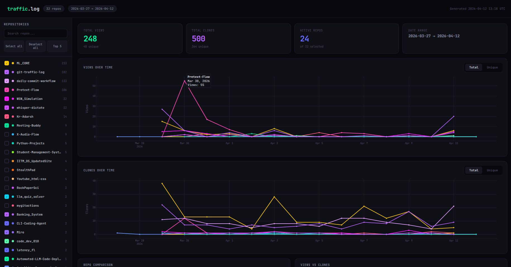

# GitHub traffic logger (going beyond 14 days ;)

GitHub only keeps traffic data for 14 days. This workflow tracks the traffic of **all your repos** beyond the 14-day limit. It runs daily via GitHub Actions, logs everything to a CSV & keeps it forever; **without cluttering your main branch.**

<!--   -->


The best part, you just need one token and it auto-discovers all your repos. Set it up once in a dedicated repo and it tracks views & clones across your entire profile automatically.


---

## how it works

A workflow runs every day at 00:15 UTC, discovers all repos accessible through your token, fetches their clone and view stats from the GitHub API, and appends only new rows to `traffic/traffic_log.csv` on a separate `analytics` branch. Your `main`/`master` branch is never touched.

### what gets tracked depends on your token

| Token type | What gets tracked |
|---|---|
| **Classic** with `repo` scope | all repos you own, collaborate on, or access via org |
| **Fine-grained** — all repos | every repo under the selected account/org |
| **Fine-grained** — specific repos | only the repos you selected when creating the token |

The script figures out which repos have the right permissions and skips the rest — no manual config needed.

---

## Setup (3 mins)

### 1. Firstly add files:

Drop these files into your repo's **default branch** (or create a dedicated `traffic-tracker` repo):

Direct files download: [Core files](https://github.com/Kr-Adarsh/git-traffic-log/releases/download/v2.0/git-traffic-logger.zip)

Manually:

     .github/workflows/traffic.yml

```
your-repo/
├── .github/
│   └── workflows/
│       └── traffic.yml
├── traffic_logger.py
├── traffic_viz.py          # optional, only for local visualization
└── requirements.txt
```

### 2. Create a GitHub token

Go to **GitHub → Settings → Developer settings → Personal access tokens → Fine-grained tokens** and create a token with:

- **Repository access** → select the repos you want to track (or "All repositories")
- **Permissions** → `Administration: Read-only` (needed for traffic API)

> Classic tokens work too — just give it the `repo` scope.

### 3. Add one secret

Go to your repo → **Settings → Secrets and variables → Actions** → New repository secret:

| Secret name | Value |
|---|---|
| `TRAFFIC_TOKEN` | the token you just created |

That's it. One secret. No username, no repo name — the script handles all of that.


### 4. Run it once manually

Go to **Actions → Capture GitHub traffic → Run workflow**.

This creates the `analytics` branch, discovers your repos, and writes the first CSV. Every subsequent run is automatic.


---

## what gets logged

```
traffic/traffic_log.csv  (on the analytics branch)
```

| Column | Description |
|---|---|
| `captured_at_utc` | when the script ran |
| `repo` | full repo name (e.g., `owner/repo-name`) |
| `type` | `view` or `clone` |
| `timestamp_utc` | the day this data point is for |
| `count` | total views or clones that day |
| `uniques` | unique visitors or cloners |

Duplicate rows are skipped thus if the same day's data is already in the CSV, it won't be written again. So running the workflow multiple times is safe.

---

## visualizing your data (optional)

Since i'm familiar with pandas and plotly, I wrote an interactive dashboard to visualize the data locally. It has a checkbox sidebar so you can toggle repos on/off, search, and compare. If you just want raw data just ignore this file.

1. Download the CSV from the `analytics` branch

2. Install deps:

```bash
pip install plotly pandas
```

3. Run:

```bash
python traffic_viz.py path/to/traffic_log.csv
```

This opens an interactive dashboard in your browser and saves a `traffic_dashboard.html` next to the CSV.


---

## files

| File | Purpose |
|---|---|
| `traffic_logger.py` | discovers repos via token, fetches traffic, appends new rows to CSV |
| `.github/workflows/traffic.yml` | runs the logger daily, commits CSV to `analytics` branch |
| `traffic_viz.py` | local visualization with interactive repo filtering |
| `requirements.txt` | python dependencies for the workflow |

---

## notes

- The `analytics` branch is created automatically on first run; no manual setup needed.
- GitHub's traffic API returns the last 14 days on every call. The logger deduplicates so you only ever store each day once.
- The workflow uses a git worktree to commit to `analytics` without ever switching branches thus nothing interferes with your actual codebase.
- Token needs admin/read access for traffic data. Repos without the right permissions are just skipped.
- Rate limiting is handled — the script checks API quota and pauses if needed.
- Works with both classic and fine-grained tokens.

#### Note:
*This started as a personal project while learning workflows and the GitHub API. Grew into something more useful so here it is. Feel free to contribute if you'd like!*

*~Kr-Adarsh*