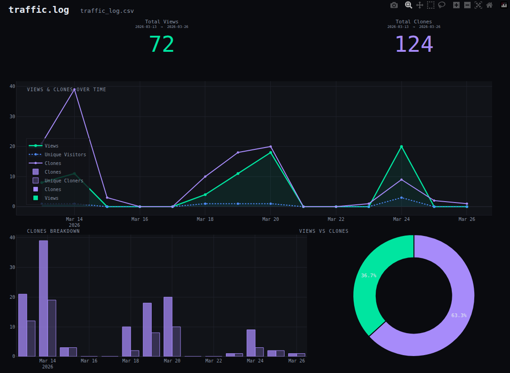
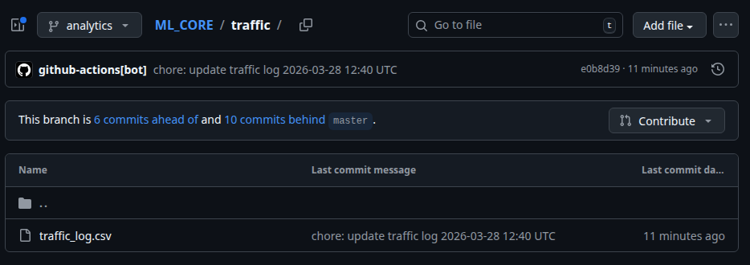
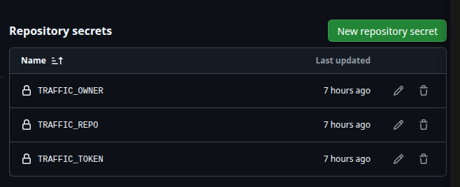
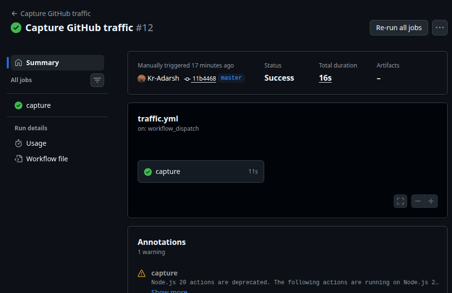

# GitHub traffic logger (going beyond 14 days ;)

GitHub only keeps traffic data for 14 days. Thus this workflow helps tracking the traffic of your repos beyound the 14-day limit. This workflow runs daily, tracking the traffic and logging it to a CSV via GitHub Actions & keeps it forever; **without cluttering your main branch.**




The best part, you can even track the traffic of any other repo by just changes the secrets, thus can even create a dedicated repo for tracking the traffic of your repos.


---

## how it works

A workflow runs every day at 00:15 UTC, fetches your repo's clone and view stats from the GitHub API, and appends only new rows to `traffic/traffic_log.csv` on a separate `analytics` branch. Your `main`/`master` branch is never touched.

---

## Setup (5 mins)

### 1. Firstly add files:

Drop these three files into your repo's **default branch**:

Direct files download: [Core files](https://github.com/Kr-Adarsh/git-traffic-log/releases/download/v1.0/git-traffic-logger.zip)

Manually:

     .github/workflows/traffic.yml

```
your-repo/
├── .github/
│   └── workflows/
│       └── traffic.yml
├── traffic_logger.py
└── traffic_viz.py   (optional, only needed for local visualization)
```

### 2. Create a GitHub token

Go to **GitHub → Settings → Developer settings → Personal access tokens → Fine-grained tokens** and create a token with:

- **Repository access** → your target repo
- **Permissions** → `Repository administration: read` (needed for traffic API)

> Classic tokens work too — just give it the `repo` scope.

### 3. Add secrets

Go to your repo → **Settings → Secrets and variables → Actions** → New repository secret:

| Secret name | Value |
|---|---|
| `TRAFFIC_TOKEN` | the token you just created |
| `TRAFFIC_OWNER` | your GitHub username |
| `TRAFFIC_REPO` | the repo name (just the name, not the full URL) |



### 4. Run it once manually

Go to **Actions → Capture GitHub traffic → Run workflow**.

This creates the `analytics` branch and writes the first CSV. Every subsequent run is automatic.



---

## What gets logged

```
traffic/traffic_log.csv  (on the analytics branch)
```

| Column | Description |
|---|---|
| `captured_at_utc` | when the script ran |
| `type` | `view` or `clone` |
| `timestamp_utc` | the day this data point is for |
| `count` | total views or clones that day |
| `uniques` | unique visitors or cloners |

Duplicate rows are skipped thus if the same day's data is already in the CSV, it won't be written again. So running the workflow multiple times is safe.

---

## visualizing your data (optional)

Since i'm familiar with pandas and plotly, I wrote a quick script to visualize the data locally. So if you just want raw data just ignore this file.

1. Pull or download the CSV locally:

Install deps:

```bash
pip install plotly pandas
```

Run:

```bash
python traffic_viz.py
# after corectly setting the path to your CSV in the script
```

This opens an interactive dashboard in your browser and saves a `traffic_dashboard.html` next to the CSV.


---

## files

| File | Purpose |
|---|---|
| `traffic_logger.py` | fetches traffic from GitHub API, appends new rows to CSV |
| `.github/workflows/traffic.yml` | runs the logger daily, commits CSV to `analytics` branch |
| `traffic_viz.py` | local visualization line charts, bar chart, doughnut breakdown built for personal use |

---

## notes

- The `analytics` branch is created automatically on first run; no manual setup needed.
- GitHub's traffic API returns the last 14 days on every call. The logger deduplicates so you only ever store each day once.
- The workflow uses a git worktree to commit to `analytics` without ever switching branches thus nothing interferes with your actual codebase.
- Token needs traffic read access. Without it you'll get a 403 on the fetch step.

#### Note:
*This is a personal project built by me while learning workflows and the GitHub API. So in case it helped you i'm glad, but I won't be maintaining it or adding features. Feel free to contribute if you'd like!*

*~Kr-Adarsh*